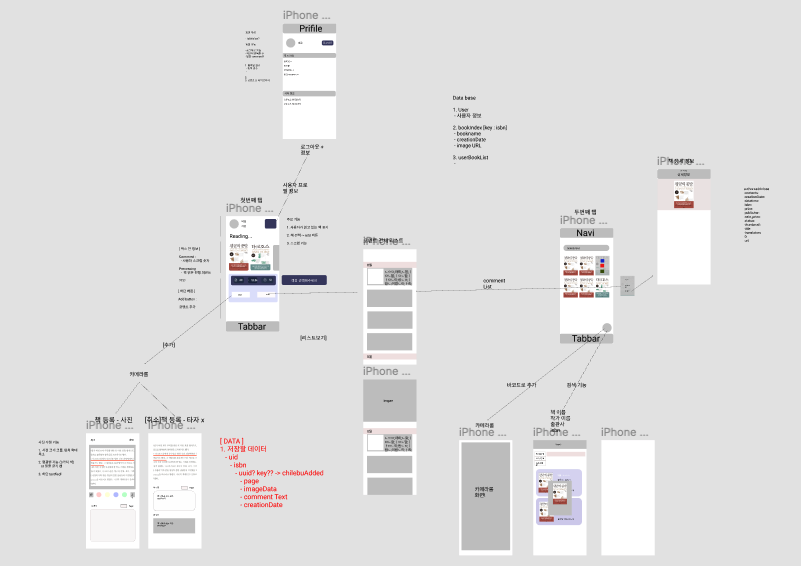

## BookReminder

### App 소개

책 읽는 순간을 저장하고 기록하세요!

책는 읽는 도중에 떠오르는 생각을 책의 문장과 함께 저장하고 나중에 읽어보세요.

책에 대한 내용이 궁금할때 다시 돌아보세요! 기억이 더 오래 가도록 돕습니다.

[AppStore Link🔗](https://apps.apple.com/kr/app/bookreminder/id1528348501)

### App 구현 사항

#### App 개발 관련 사항

- 프로젝트 기간 

  - 2020.08.03 ~ 2020.08.14 ( 약 2주 )  in FastCampus iOS School

- MVC 디자인 페턴을 통한 구현

- Firebase를 통한 사용자 인증 및 데이터 저장 기능 구현

- figma를 통한 디자인 

  

#### App 기능 실행 화면

##### API를 통한 책 등록 기능

- 책 이름 검색 또는 스케너를 통한 등록

    
    

- 책 사진 촬영 후 사용자 코멘트와 함께 서버 업로드

    
    

- 책 완독 및 제거 기능

    

### 후기

 **BookReminder** 는 처음으로 기획, 디자인, 설계 및 구현까지 혼자서 진행한 프로젝트입니다. 평소에 책을 읽으면서 읽었던 내용을 자주 잊어버리는 경험이 있어서 이 앱을 기획하게 되었습니다.

 앱을 구현하면서 가장 어려웠던 점은 Firebase를 통해서 데이터를 저장하고 불러오는 과정과 이미지에 선을 긎는 기능이였습니다. 이는 교육과정에 별도로 포함이 되어있지 않아서 인터넷을 통해 스스로 학습하고 구현하는 과정에서 많은것을 배우게 되었습니다. 이를 통해서 배우지 않은 기능도 검색을 통해 구현할 수 있다는 자신감이 생겼습니다.

  디자인, 사용자 관점에서도 어색한 부분이 있지만 기획했던 기능들을 구현하는 과정에서 여러가지를 학습하면서 실력 향상에 많은 도움이 되었습니다. 또한 iOS개발자로써 꼭 경험해야 하는 앱 심사, 배포를 완료한 것이 가장 큰 성과 였다고 생각합니다.

